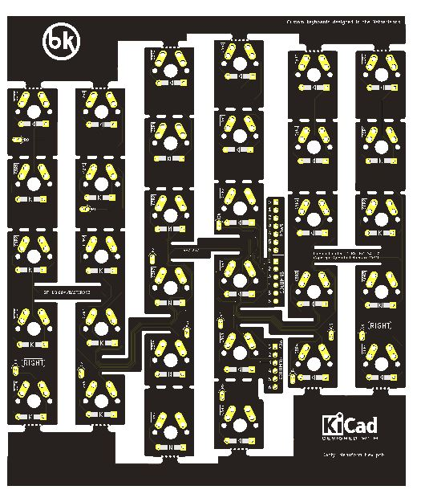

# Dactyl Manuform Mini PCB - plate

Flexible PCB made for the Dactyl Manuform Mini - up to 6x6 and breakable down to 5x3.

This repository contains all files necessary to order a PCB.

If you want to modify the design files, the Kicad sources are included (you will need a 5.99 nightly version).
If you just want to order the PCBs, check out the Release section which contain the gerber files.

## How to order

Order with a 0.6mm PCB thickness

# Support me on Patreon

If you like the keyboard, please consider helping me with Patreon: https://www.patreon.com/bastardkb

I post regular updates and hindsight on my work. I work full time on keyboard innovation, and this helps a lot !

## License

Licensed under CC BY-NC-SA 4.0
Copyright Quentin Lebastard 2021
